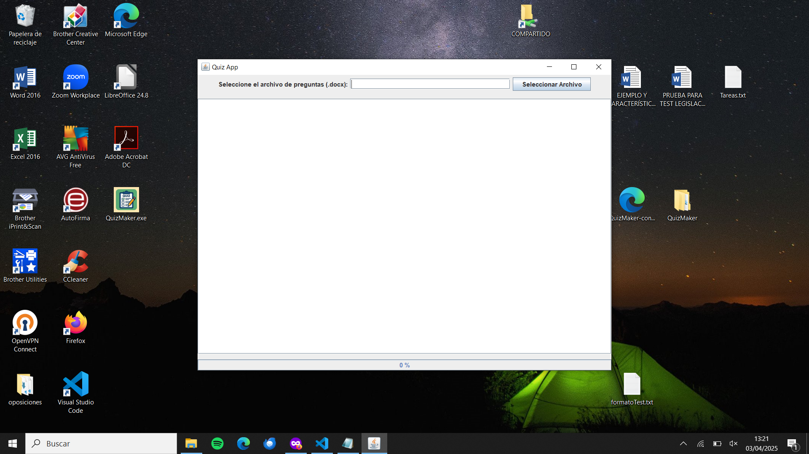
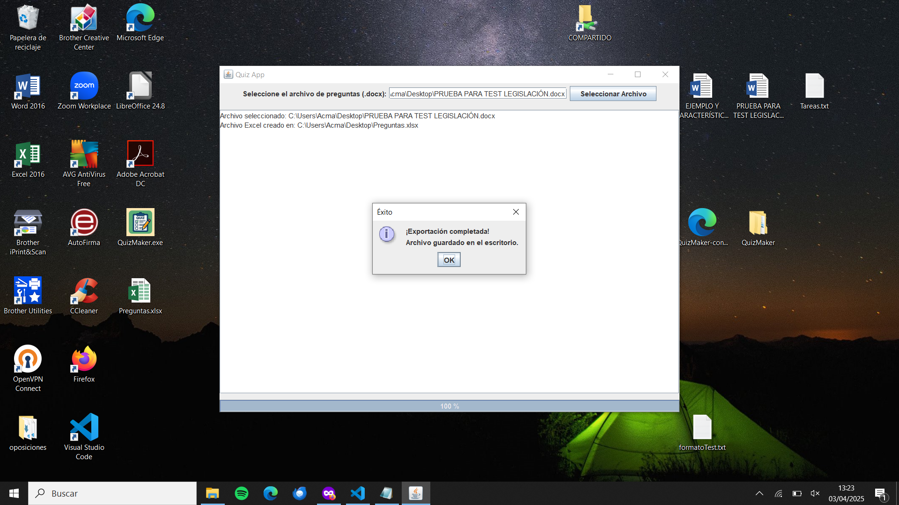

# QuizMaker

**Versión 1.4 - Proyecto en desarrollo**

QuizMaker es una aplicación de escritorio desarrollada en **Java 21** que permite extraer preguntas tipo test desde documentos `.docx` y exportarlas automáticamente a formatos `.xlsx` (Excel) y `.txt` (formato **Aiken** compatible con Moodle). Todo esto a través de una interfaz gráfica amigable construida con **Swing**.

Su objetivo es facilitar la creación de tests automatizados para ser utilizados en plataformas educativas como **Google Forms**, **Moodle** o integraciones con **WordPress**.

---

## Características Principales

- Interfaz gráfica intuitiva (Swing).
- Soporte para **exportación a Excel (.xlsx)**.
- Soporte para **exportación a texto plano en formato Aiken (.txt)**.
- Botón de salida para cerrar la aplicación de forma segura.
- Separación clara entre preguntas (salto entre tests).
- Compatible con Google Forms y Moodle.
- Preparado para futuras integraciones con la API de Google Forms.
- Generación de ejecutables `.exe` con **Launch4j**.
- Documentado con **Javadoc**.

---

## Tecnologías Usadas

- **Java 21**
- **Apache Maven**
- **Swing** (Interfaz gráfica)
- **Apache POI** (lectura de `.docx`, generación de `.xlsx`)
- **Launch4j** (creación de ejecutables para Windows)
- **Google API Client** _(listo para integración con Google Forms)_

---

## Requisitos Previos

- **JDK 21** o superior
- **Apache Maven** instalado y configurado
- **Windows** (para generar o ejecutar el `.exe`)

---

## Instalación y Ejecución

### Clonar el repositorio

```bash
git clone https://github.com/TonyArPe/QuizMaker.git
cd QuizMaker/app-quiz
```

### Generar el .jar ejecutable con dependencias

```bash
mvn clean package
```

**El .jar se genera en: target/demo-1.0-jar-with-dependencies.jar**

### Crear el .exe con Launch4j

1. Abre Launch4j

2. En Jar, selecciona:
   _target/demo-1.0-jar-with-dependencies.jar_

3. En Output, define la ruta de salida del `.exe`

4. En Main class, escribe:
   _com.example.quiz.QuizAppGUI_

5. **Opcional:** agrega un icono .ico

6. Haz clic en Build Wrapper

## ¿Cómo se usa?

1.  Ejecuta `QuizMaker.exe` o el `.jar.`

2.  Selecciona un archivo .docx con preguntas.

3.  Puedes:

    - Exportar a Excel (.xlsx) con un botón.

    - Exportar a Aiken (.txt) con otro botón.

Ambos archivos se guardan automáticamente en tu Escritorio.

## Estructura del Proyecto

**QuizAppGUI.java →** Interfaz gráfica principal.

**MainApp.java →** Versión por consola (modo legacy).

**FileSelector.java →** Lógica de lectura de .docx.

**ExcelCreator.java →** Exportación a .xlsx.

**AikenFormatter.java →** Conversión al formato Aiken.

**TxtCreator.java →** Exportación a .txt en formato Aiken.

## Notas Adicionales

- El análisis se basa en encabezados como 1. Pregunta o Pregunta 1:.

- El botón de exportación a .txt genera una pregunta por bloque, separada por salto de línea.

- Se recomienda cerrar el archivo Excel antes de volver a generar uno nuevo.

- El ejecutable puede personalizarse con icono y nombre con Launch4j.

- Google Forms aún no está conectado, pero el formato generado es compatible.

## Autor

**TonyArPe** – Desarrollador y creador del proyecto.
**Repositorio oficial:** `github.com/TonyArPe/QuizMaker`

## Licencia

Este proyecto está licenciado bajo la Licencia **MIT**.
Consulta el archivo **LICENSE** para más información.

## Imagenes de Muestra



